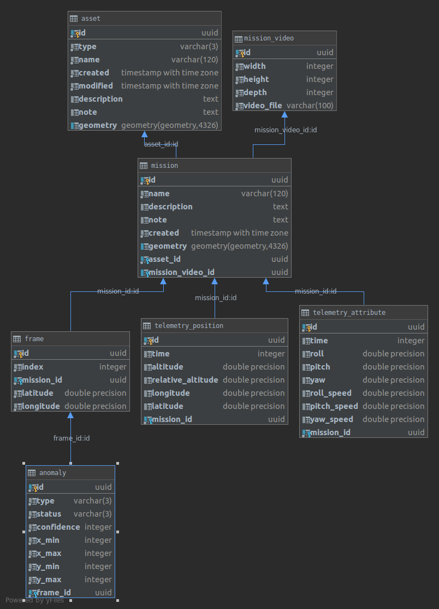

[](https://api.travis-ci.com/geosolutions-it/sciadro-backend)
[](https://codecov.io/github/geosolutions-it/sciadro-backend?branch=master)

# sciadro-backend

## DB Schema


## Local run

Install:
- Docker
- Docker composer

To run application open terminal window and run in the root project directory:

```./start.sh```

Then navigate your browser to http://localhost:8000

To stop application open terminal and run in the root project directory:

```./stop.sh```

## Tests

To run tests open terminal window and run in the root project directory:

```./test.sh```


## Development environment

To run docker setup with local user docker compose seek for CURRENT_UID environmental variable
Remember to set it fir example in following way:
CURRENT_UID=$(id -u):$(id -g)
